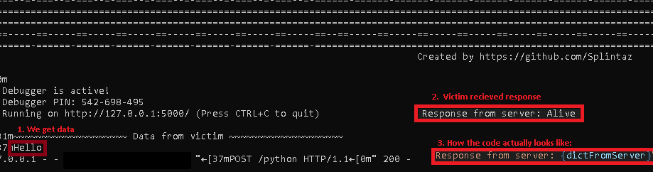

# O-PaC
O-PaC (Office Program and Control) allows you to send remote commands and receive encrypted data with a Word/Excel/PowerPoint Macro. 

# What is O-PaC?

It uses Flask as the web framework to host your website, and when the victim runs the document, it will allow you to execute remote commands so that you recieve the data. The macro will not run automatically inside Word or PowerPoint, so Excel is your best option.

This macro also has a way of bypassing Windows Defender by creating a child process of Outlook, which is the only Office application which does not freak out. Even if Microsoft fixed it, it would probably break Outlook (at least I'm told so). However, many big companies do implement a way to block all Office applications from creating child processes. Beware: https://docs.microsoft.com/en-us/windows/security/threat-protection/microsoft-defender-atp/attack-surface-reduction

You will be able to recieve encrypted data. It's a custom encoded message, most organizations look for Base64 encoding when monitoring traffic so this is simple, but effective. It can be seen with Wireshark, but to the normal person it's just gibberish.

To decrypt it, paste the decrypt.txt inside a new macro, put your encrypted text inside STRING and run it. The C2 can handle multiple commands but has no encryption, while the ENC can handle a single encrypted message.

* C2 = Command and Control
* ENC = Encrypt
* DEC = Decrypt

# Instructions

1. First, you will have to install dependencies. Navigate to the OfficePac folder with your terminal and type:
- pip install -r requirements.txt
2. Run the main.py file to host your webserver
3. Copy from O-PaC/macro/c2.txt or OpaC/macro/enc.txt to your Excel document, and save it as a .xlsm
4. Enable editing, and then re-run it. It should automatically run the macro.
5. You should now be able to execute remote commands on the victim

# Extra 
You can also use Python instead of Word. 

1. Run the main.py file to host your webserver
2. Execute the request script inside OfficePac/extra/requests.py

3. You should now recieve a "Hello" string from the victim, and the victim will recieve a "Alive" string
