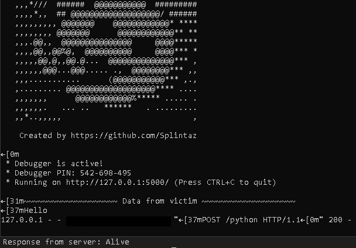

# WordPac
WordPac (Word Program and Control) allows you to send remote commands and receive encrypted data with a Word Macro. 

# How does it work?

It uses Flask as the web framework to host your website, and when the victim runs the document, it will allow you to execute remote commands so that you recieve the data.

You will be able to recieve encrypted data, and then decode it with Word. It's a simple encoded message, however most organizations look for Base64 encoding when monitoring traffic so this is simple, but effective. It can be seen with Wireshark, but to the normal person it's just gibberish.

To decrypt it, paste the decrypt.txt inside a new Word macro, put your encrypted text inside STRING and run it.

# Instructions

1. First, you will have to install dependencies. Navigate to the WordPac folder with your terminal and type:
- pip install -r requirements.txt
2. Run the main.py file to host your webserver
3. Copy from WordPac/macro/c2.txt to your Word Document, and save it as a .docm
4. Execute the script
5. You should now be able to execute remote commands on the victim

# Extra 
You can also use Python instead of Word. 

1. Run the main.py file to host your webserver
2. Execute the request script inside WordPac/extra/requests.py

3. You should now recieve a "Hello" string from the victim, and the victim will recieve a "Alive" string
