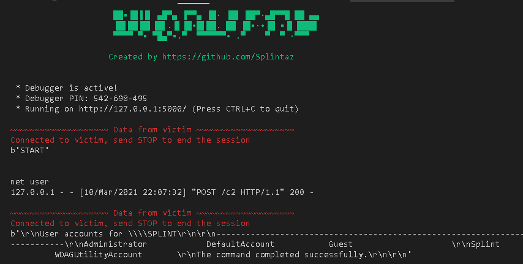

# WordPac
WordPac (Word Program and Control) allows you to send commands and receive data with a Word Macro. 

                     ▄▄▌ ▐ ▄▌      ▄▄▄  ·▄▄▄▄   ▄▄▄· ▄▄▄·  ▄▄· 
                     ██· █▌▐█▪     ▀▄ █·██▪ ██ ▐█ ▄█▐█ ▀█ ▐█ ▌▪
                     ██▪▐█▐▐▌ ▄█▀▄ ▐▀▀▄ ▐█· ▐█▌ ██▀·▄█▀▀█ ██ ▄▄
                     ▐█▌██▐█▌▐█▌.▐▌▐█•█▌██. ██ ▐█▪·•▐█ ▪▐▌▐███▌
                     ▀▀▀▀ ▀▪ ▀█▄▀▪.▀  ▀▀▀▀▀▀• .▀    ▀  ▀ ·▀▀▀
# How does it work?

It uses Flask as the web framework to host your website, and when the victim runs the document, it will allow you to execute remote commands so that you recieve the data.

The data can be seen with Wireshark, but I didn't bother to actually encrypt the data. There is some Base64 encryption code inside c2.txt that you should be able to maneuver if you're tech savvy.

# Instructions

1. First, you will have to install dependencies. Navigate to the WordPac folder with your terminal and type:
- pip install -r requirements.txt
2. Run the main.py file to host your webserver
3. Copy from WordPac/macro/c2.txt to your Word Document, and save it as a .docm
4. Execute the script
5. You should now be able to execute remote commands on the victim

# Extra 

1. Open WordPac/extra/extra.txt
2. Paste the views.route inside WordPac/post/views.py
3. Create a new file for the request
4. Run the main.py file to host your webserver
5. Execute the request script

6. You should now recieve a "Hello" string from the victim, and the victim will recieve a "Alive" string
